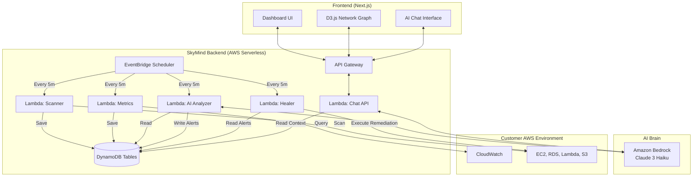

# 🧠 SkyMind — AI-Powered Cloud Infrastructure Brain

SkyMind is a self-healing, self-optimizing cloud infrastructure system built on AWS. It uses **Amazon Bedrock (Claude Haiku)** and specialized AI agents to monitor your AWS environment, predict failures, execute autonomous remediation, and optimize your cloud spend in real-time.

 *(Note: Add the dashboard screenshot you captured here later!)*

## 🚀 The 4 Core Capabilities

1. **Live Infrastructure Map**: Real-time D3.js visualization of all your AWS resources, dependencies, and health statuses.
2. **AI Cost Optimizer**: Continuously scans for waste (idle instances, over-provisioned databases, old logs) and calculates exact dollar savings.
3. **Predictive Failure & Self-Healing**: Detects anomalies in CloudWatch metrics, predicts failures before they trigger downtime, and auto-executes remediation (e.g., auto-scaling, restarting tasks). High-risk actions demand human approval.
4. **Natural Language Ops**: Chat with your infrastructure. Ask *"Why did latency spike?"* and SkyMind queries your logs, traces the root cause, and responds in plain English with evidence.

## 🏗️ Technical Architecture (Serverless & Event-Driven)

SkyMind is built primarily on serverless AWS technologies to ensure it has virtually zero operational overhead and costs less than $10/month to run.



## 🔐 Security by Design

Giving an AI the "keys to the kingdom" is dangerous. SkyMind implements strict boundaries:
- **Least-Privilege IAM**: The Scanner, Metrics, and Analyzer agents have **Read-Only** access. Only the Healer agent has Write access, restricted to specific non-destructive actions.
- **Human-in-the-Loop**: Destructive actions (like terminating an instance) are never automated. SkyMind flags them as alerts requiring explicit human approval via the dashboard.
- **In-Account Deployment**: All data processing stays within your AWS boundaries. No logs or metrics are ever sent to third-party SaaS providers outside of Amazon Bedrock.

## 💻 Tech Stack

- **Frontend**: Next.js 14, React 18, D3.js (Force-directed graphs), Lucide Icons, Pure CSS (Glassmorphism design system)
- **Backend**: Node.js 18 on AWS Lambda, API Gateway
- **Database**: Amazon DynamoDB (Single-table design principles)
- **AI/ML**: Amazon Bedrock (Anthropic Claude 3 Haiku for analyzing anomalies and powering NL Ops)
- **Infrastructure as Code**: AWS CDK (TypeScript/JavaScript)

## 🛠️ How to Run Locally (Mock Mode)

The frontend comes with a built-in mock/simulation mode so you can test the UI and see the dashboard immediately without deploying to AWS.

1. Navigate to the frontend directory:
   ```bash
   cd frontend
   ```
2. Install dependencies:
   ```bash
   npm install
   ```
3. Run the development server:
   ```bash
   npm run dev
   ```
4. Open `http://localhost:3000` in your browser.

## ☁️ How to Integrate SkyMind (Enterprise Deployment)

SkyMind is designed for **instant, secure integration** into any AWS environment. It does not require you to rewrite your existing applications or change your infrastructure.

### The CI/CD Pipeline & OIDC Security Model

When integrating third-party tools, security is the highest priority. SkyMind uses **AWS OpenID Connect (OIDC)** and GitHub Actions for deployment.
* ❌ **No long-lived AWS IAM Users or static credentials are used.**
* ✅ GitHub and AWS use temporary, 1-hour STS tokens to authenticate.
* ✅ All permissions are scoped strictly to the deployment role and the repository.

### Integration Steps

To deploy this AI agent directly into your AWS account to begin scanning for bugs and cost waste:

1. **Fork this Repository**: Clone or fork this codebase into your GitHub organization.
2. **Establish the OIDC Trust (One-Time Setup)**:
   An AWS Administrator runs the following in their terminal to create the OIDC connection:
   ```bash
   cd infra
   npm install
   npx cdk deploy SkyMindGitHubOidcStack
   ```
   *Copy the resulting Role ARN output.*
3. **Add the Deployment Secret**: 
   In your GitHub Repository, navigate to **Settings > Secrets and variables > Actions** and add `AWS_OIDC_ROLE_ARN` with the Role ARN.
4. **Deploy the Agents**:
   Push any commit to the `main` branch. GitHub Actions will securely authenticate to your AWS account and instantly deploy the Lambda agents, DynamoDB tables, and API Gateway using AWS CDK.

**Result**: Within 5 minutes, the SkyMind active scanners will wake up, map your entire AWS architecture, flag failing resources, identify idle costs, and expose the data to the Next.js React Dashboard.

## 🤔 Business Value

Companies spend billions of dollars annually on cloud waste and reactive incident management. Existing tools (Datadog, PagerDuty) tell you *when* things break; they don't fix them for you. 

I built SkyMind to demonstrate that modern infrastructure monitoring shouldn't just be dashboards — it should be an **autonomous, self-healing agent** that actively saves money and reduces downtime.

